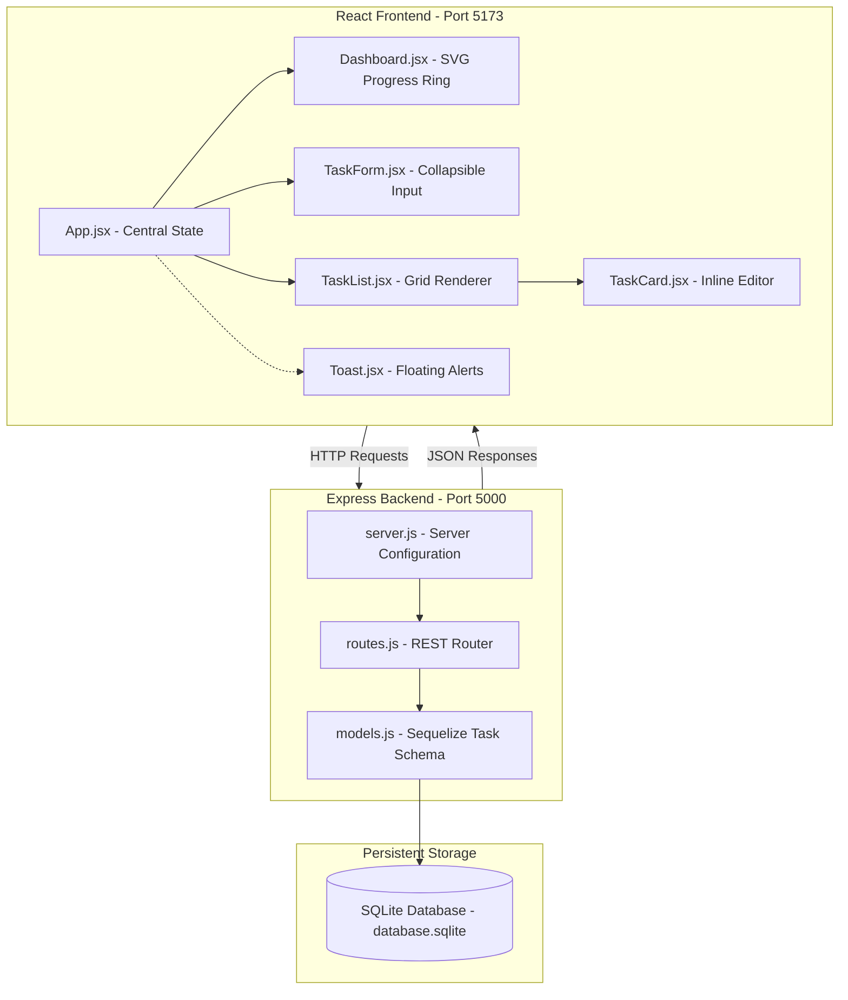

# Focus Flow — Premium Task Dashboard

Focus Flow is a full-stack, visually rich To-Do dashboard application. It uses a **glassmorphism** visual language, supporting customizable theme states (Sleek Dark Mode / Elegant Light Mode), animated status analytics, task metadata (priorities, categories, due dates), search, and sorting.

---

## 🏗️ Architecture & Component Design



---

## ✨ Features

### 🎨 Visual & UX Excellence
- **Double-Themed Palette**: Transitions between a neon-accented dark mode and a sage-green light mode (`#a6dbbc`) using local CSS variables.
- **Glassmorphic Layout**: Transparent panel designs styled with custom blur filters (`backdrop-filter`) and drop shadows.
- **Interactive Checklist Check**: Animates with custom drawing checkmarks and scale transitions.
- **Floating Toast Notifications**: Instantly alerts users to additions, changes, and completions.

### 📊 Productivity Dashboard
- **Completion Tracking**: Circular dynamic SVG progress ring mapping task ratios.
- **Categorization**: Groups items under Personal, Work, Shopping, Health, Finance, Ideas, or Custom.
- **Priority Tiers**: Color-coded borders matching Low (Teal), Medium (Amber), and High (Rose) priorities.
- **Smart Due Dates**: Visual indicators highlighting tasks that are overdue.

---

## 🛠️ Tech Stack & Dependencies

### Frontend Client
- **Core Library**: React (Vite-scaffolded)
- **Styling**: Pure CSS Custom Variables (Vanilla CSS)
- **State Management**: React State Hooks (`useState`, `useCallback`, `useEffect`)

### Backend Server
- **Runtime**: Node.js
- **Server Framework**: Express.js
- **ORM Interface**: Sequelize ORM
- **Database Engine**: SQLite3 (File-based SQL)

---

## 🚀 Quickstart & Installation

To run the application locally:

### 1. Start Express Server
Navigate to the `server/` directory, install packages, and start the development server:
```bash
cd server
npm install
npm run dev
```
The server will synchronize the database and start listening at **`http://localhost:5000`**.

### 2. Start Frontend App
Navigate to the `client/` directory, install packages, and start the Vite server:
```bash
cd client
npm install
npm run dev
```
The client compiles files and will launch at **`http://localhost:5173`**.

---

## 🔌 API Reference Document

The backend exposes a REST API at `http://localhost:5000/api`.

### 1. Get Tasks
- **URL**: `/tasks`
- **Method**: `GET`
- **Query Parameters** (Optional):
  - `status`: Filter by status (`active` or `completed`)
  - `search`: Match search keywords in title or description
  - `category`: Filter by category (e.g. `Work`, `Personal`)
  - `sortBy`: Sort tasks (`createdAt`, `dueDate`, `priority`, `title`)
- **Success Response** (`200 OK`):
  ```json
  {
    "success": true,
    "count": 1,
    "tasks": [
      {
        "id": "b3e34b12-9cbf-4e78-831e-450f68285513",
        "title": "Design user dashboard",
        "description": "Create glassmorphic mockups.",
        "isCompleted": false,
        "priority": "high",
        "category": "Work",
        "dueDate": "2026-07-15",
        "createdAt": "2026-06-25T18:00:00.000Z",
        "updatedAt": "2026-06-25T18:00:00.000Z"
      }
    ]
  }
  ```

### 2. Add New Task
- **URL**: `/tasks`
- **Method**: `POST`
- **Request Body**:
  ```json
  {
    "title": "Grocery shopping",
    "description": "Almond milk, eggs, berries",
    "priority": "medium",
    "category": "Shopping",
    "dueDate": "2026-06-30"
  }
  ```
- **Success Response** (`201 Created`):
  ```json
  {
    "success": true,
    "message": "Task created successfully",
    "task": {
      "id": "e4f8d9b1-2a4c-4e89-9a7e-128a92350b92",
      "title": "Grocery shopping",
      "description": "Almond milk, eggs, berries",
      "priority": "medium",
      "category": "Shopping",
      "dueDate": "2026-06-30",
      "isCompleted": false,
      "createdAt": "2026-06-25T18:05:00.000Z",
      "updatedAt": "2026-06-25T18:05:00.000Z"
    }
  }
  ```

### 3. Update Task
- **URL**: `/tasks/:id`
- **Method**: `PUT`
- **Request Body** (Provide only fields to update):
  ```json
  {
    "isCompleted": true,
    "priority": "low"
  }
  ```
- **Success Response** (`200 OK`):
  ```json
  {
    "success": true,
    "message": "Task updated successfully",
    "task": { ... }
  }
  ```

### 4. Delete Task
- **URL**: `/tasks/:id`
- **Method**: `DELETE`
- **Success Response** (`200 OK`):
  ```json
  {
    "success": true,
    "message": "Task deleted successfully"
  }
  ```

### 5. Clear Completed Tasks
- **URL**: `/tasks/clear-completed`
- **Method**: `POST`
- **Success Response** (`200 OK`):
  ```json
  {
    "success": true,
    "message": "3 completed tasks cleared successfully",
    "deletedCount": 3
  }
  ```

### 6. Get Task Stats
- **URL**: `/tasks/stats`
- **Method**: `GET`
- **Success Response** (`200 OK`):
  ```json
  {
    "success": true,
    "stats": {
      "total": 5,
      "completed": 2,
      "pending": 3,
      "percentCompleted": 40,
      "priorityBreakdown": {
        "low": 1,
        "medium": 2,
        "high": 2
      }
    }
  }
  ```

---

## 💾 Database Schema

The SQLite schema is defined dynamically in Sequelize within `server/models.js`:

| Column | Type | Constraints | Default |
| :--- | :--- | :--- | :--- |
| **`id`** | UUID | Primary Key | UUIDV4 |
| **`title`** | String | NOT NULL, Not Empty | |
| **`description`**| Text | | `""` |
| **`isCompleted`**| Boolean | | `false` |
| **`priority`** | ENUM | `'low'`, `'medium'`, `'high'` | `'medium'` |
| **`category`** | String | | `'General'` |
| **`dueDate`** | DateOnly | Nullable | `null` |
